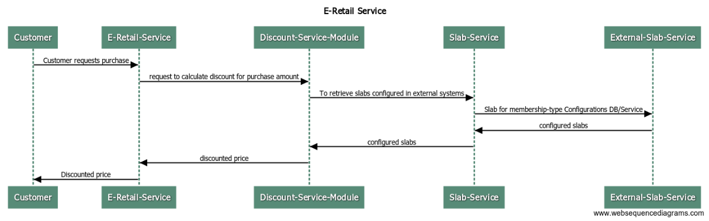

# E-Retail

## Sequence Design Diagram

### Discount Service Module
* Contains logic for discount calculation on the purchased amount for the customer
* Discount Service connects to Slab Service Module for retrieving slabs configured in DB/external system
### Slab Service Module
* This Service module communicates with external slab repositories or service to retrieve configured slab details.
    
### Running Test Cases
* Please run DiscountServiceTest.java for running scenarios for different slabs.
